# PJD.XcaDocumentSource - XCA Responding Gateway and integrated Document Registry and Repository  

## Introduction
This document will describe the Norwegian usage and profilings of the IHE integration profiles based on XDS, XCA and XUA provided in Volumes 1 through 3 of the [IHE IT Infrastructure Technical Framework ↗](https://profiles.ihe.net/ITI/TF/index.html) in a national context.
Patient Health Records (PHR) facilitates Cross enterprise document sharing between health professionals and between health professionals and citizens in Norway. The main objectives of PHR are:  

* Give health professionals necessary access to referrals, discharge summaries and other types of reports (documents) stored in other healthcare enterprises to achieve more effective health care decisions and reduce errors.
* Reduce the administrative burden and costs of today's collection and delivery of health information.
* Increase the overview of available health information across enterprises.
* Enable access to patients to their medical records throughout Norway.


## Semantics Used  
This section defines how different elements are formatted and referenced within the documentation.

### External hyperlinks
External links are suffixed by an arrow pointing up to the right ( ↗), signifying that the link leads to a website not affiliated or related to Norsk helsenett. Links will follow this format:  `<title> - <domain> ↗`
**Example:**  
[External link - example.com ↗](https://www.example.com) 

### XML-tags  
Used when referencing something thats part of an XML SOAP-message  
**Example:**   
`<xml-tag>`


### Normal Quotes  
Used as an addendum for a section of text  
**Example:**  
>Quote

### Alert Quote
When there's something that should be paid extra attention to, or is important to know  
**Example:**
> **⚠️ Alert x** <br> Example text

### Implementation Quotes  
Used to describe an implementation which is notable or specific to **PJD.XcaDocumentSource**  
**Example:**
>**🔶 Implementation Note x** <br> Example text

### National Extension Quote  
Used to describe something specific to the **Norwegian** implementation of **IHE XDS/XCA**  
**Example:**
>**🚩 National Extension x** <br> Example text


## Document sharing - Actors and components  
The **XDS-architecture** consists of the following actors/components:


### Document source  
A document source is typically an **EHR-system** or backend solution which has produced or stores a document which will be shared using the **XDS-solution**.


### Document consumer  
A document consumer is typically a **EHR-system** (or citizen portal) which queries the **Document Source** for documents on a given patient.


### Document repository
A document repository is the service responsible for storing or making the document accessible. an **XDS-solution** can consist of one or more document repositories.


### Document Registry  
The Document Registry contains information (metadata) about all archived documents in the XDS area served by this document repository. An XDS site is always served by only one document repository, but a document repository can cover multiple XDS areas.
In addition to metadata about existing documents, the document register contains pointers to the document archive where the document is stored.


### Affinity Domain  
The concept of an Affinity Domain is, literally and figuratively, central in the realm of sharing health documents. The XDS-profile describes how documents are shared across enterprise boundaries within an Affinity Domain, as well as the rules that make sharing possible. An Affinity Domain has its own unique identifier, known as a **HomeCommunityID**. This ID is used when querying the domain.  
The boundaries of an Affinity Domain is not specified, but a logical separation within a country is natural. In Norway, this separation is on a **RHF** (Regionalt helseforetak)-level. This level of separation makes it possible for the Affinity Domains to profilings catered towards the needs of both the domain, aswell as the **RHF**.


### Patient identity source  
This component ensures every patient is given an **unambigous identificator**, for example a local, regional or nationwide population register.
>**🚩 National Extension**<br> In Norway, a personal identificator is in use (person number), so a dedicated service for handling patient identifications is not required.


## Object Identifiers (OID)
>**Note:** For OIDs to effectively work, there must be some level of governance when creating and managing OIDs. Norsk helsenett (NHN) should have a comprehensive overview of the OIDs related to PHR. NHN shall be informed of the OID of a new document source.

OID (Object Identifiers) are unique identifiers for objects or things. **Anything can have an OID, and an OID is nothing more than a set of numbers and dots (.) which make up a hierarchical structure**. In PHR, OIDs are used to unambiguously identify a system or facility. The OIDs might get translated by the systems into the actual URL, which means the URL can change, but the OID stays the same. OIDs are also used in logging. OIDs have a "tree/path"-like structure, and can be represented by its numerical or text variant.  
More about OIDs on [NHN's Developer portal ↗](https://utviklerportal.nhn.no/informasjonstjenester/pasientens-journaldokumenter-i-kjernejournal/mer-om-tjenesten/oider/) (In Norwegian).  

### Governing Object Identifiers
Even though OIDs are simply numbers and dots, its the way that its governed and controlled which defines its effectiveness in practice. Having good control over an OID structure leads to effective communication and identification.   

>**🔶 Implementation Note x** <br> In **PJD.XcaDocumentSource**, OIDs are used for **RepositoryID** and **HomecommunityID**.

The **Norwegian profile of IHE XDS metadata** defines the use of OIDs for identifying communities. Norsk helsenett (NHN) governs an OID-base and is the primary issuer of an OID to a community. Each Norwegian health region also governs their own OIDbase and can choose to issue their own homecommunity ID.  
The OID-base which NDE governs has the following OID structure for document sharing:
* 2.16.578.1.12.4.1.7 – Document sharing root OID
  * 2.16.578.1.12.4.1.7.1 – Community base OIDs governed by NHN
    * 2.16.578.1.12.4.1.7.1.1 – National community
> **⚠️ Alert x:** <br> Historically, this OID-base has belonged to The Norwegian Directorate of eHealth (NDE/e-Helse) for PHR (formely known as Dokumentdeling)

## Document consuming process
Below is a diagram showing the process of retrieving the document-list and the document. Each affinity domain has its own XCA, which again has its own registry and repositories.  
When querying for a list of documentr , the Registry is queried, as it holds the metadata and references to the documents in the repository. When retrieving a document, the repository is queried with the ID from the Registry metadata item of interest.

```mermaid
sequenceDiagram
    actor GP
    participant KJ as EHR/Kjernejournal
    participant NHN_XCA
    participant HSØ_XCA
    participant HV_XCA
    participant HN_XCA
    GP->>KJ:Login
    KJ-->>KJ:Select patient
    KJ-->>KJ:Open PHR-instance
    KJ->>NHN_XCA:ITI-18
    NHN_XCA->>HSØ_XCA:ITI-38
    HSØ_XCA->>NHN_XCA:Response
    NHN_XCA->>HV_XCA:ITI-38
    HV_XCA->>NHN_XCA:Response
    NHN_XCA->>HN_XCA:ITI-38
    HN_XCA->>NHN_XCA:Response
    NHN_XCA->>KJ:Document-list
    GP->>KJ:Opens Document X from HSØ
    KJ->>NHN_XCA:ITI-43
    NHN_XCA->>HSØ_XCA:ITI-39
    HSØ_XCA->>NHN_XCA:Response
    NHN_XCA->>KJ:Document
```

*Figure x: Simplified example on a query of document, each XCA is its own affinity domain, and the response for each domain may be different (ie. some domains reject requests from certain GP-roles)*


## SOAP-Message and SOAP-message formats  
An **XML SOAP-message** (also known as **SOAP-envelope**) is defined by an enclosing `<Envelope>`-tag and a `<Header>` and `<Body>` tag. The Header holds information about the request in the Body, such as the Action performed.
**SOAP-messages** are commonly transmitted over **HTTPS** as a `POST`-request, with the **SOAP message** as the request payload.

### Sample SOAP-message
```xml
<Envelope>
    <Header>
        <Action>urn:ihe:iti:2007:RegistryStoredQuery</Action>
        <MessageId>12345678-abcd-efab-cdef-123456789abc</MessageId>
        <Security>
            [SAML-token]
        </Security>
    </Header>  
    <Body>
        <!-- Content in body is expected to adhere with <Action> -->
        <AdhocQueryRequest>
            [Request]
        </AdhocQueryRequest>
    </Body>
</Envelope>
```
*Example SOAP-envelope. Namespaces are omitted for clarity*

There is excpected to be a **1:1 relationship** between the **SOAP action** (`<Action>`-field in the **SOAP-header**) and the content in the request body

### Terminology in Document sharing
| Term  | Definition | Example |
|---|---|---|
| Assigning Authority | Used in conjunction with metadata. Consists of an unique identifier for the organization or system responsible for governing or producing said data. Also used for defining the format of the data. | `13116900216^^^&amp;2.16.578.1.12.4.1.4.1&amp;ISO` <br> *Here the **OID** identifies the **assigning authority** for defining what the numbers `13116900216` represent (`<Birth-number>^^^<OID defining birth numbers>`)*  |
| Code System | A Code System defines a set of coded values that can be used in XDS metadata, such as document types, healthcare facility types, and event codes  | `codeSystem="urn:oid:2.16.578.1.12.4.1.1.9060"` |
| Code System Name | The name of a specific code system | `codeSystemName="Kategori helsepersonell"` |
| OID | Object Identifier - Used to identify a single organization or system | `2.16.578.1.12.4.1.` |
| TBD |  | `TBD` |

*Table x: terminology used for types in IHE XDS*  

## Types in IHE XDS  
There are different types used to contain and structure various pieces when storing and making documents available. It's imperative that the reader familiarizes themself with each type and where they usually reside in a **SOAP-message**.  
The types can be abstracted to this diagram, showing how Document Sharing Objects contain metadata types, which in turn contains Coded values of Data on specific formats.

```c#
[Document Sharing Objects]
    [Metadata Types]
        [Coded Values]      :: String
        [Data]              :: String
        [HL7 Data Types]    :: String
```
*Generalized structure of data types in document sharing*


### Document Sharing Objects  
Some of the **XML Types** described below can be used to represent different concepts.  
The table below describes the different types.  

| Document Sharing Object/Association  | XML Type representation |
|---|---|
| DocumentEntry	 | `<ExtrinsicObject>` |
| SubmissionSet | `<RegistryPackage>` |
| Folder | `<RegistryPackage>` |
| HasMember | `<Association>` |
| MemberOf | `<Association>` |
| Relationship | `<Association>` |

*Table x: Document Sharing concept correspondence with XML Types*

#### SubmissionSet
A SubmisisonSet contains the details about all resources related to a specific document. Through Associations, other objects like Folders and DocumentEntries are linked to the submission set.
More about SubmissionSet [4.1.1.1 SubmissionSet - profiles.ihe.net ↗](https://profiles.ihe.net/ITI/TF/Volume3/ch-4.1.html#4.1.1.1)

#### Association
Associations are links between a source objects and target object, such as a DocumentEntry and a SubmissionSet
More about Associations [4.1.2 Association Types - profiles.ihe.net ↗](https://profiles.ihe.net/ITI/TF/Volume3/ch-4.1.html#4.1.2)

#### DocumentEntry
**DocumentEntry** contains attributes describing a document. It contains information about who created the document, what type of document it is, and where to retrieve it. **It does not contain the document itself**, as the documents reside in the **Document Repository**. **DocumentEntries** can differ based on the **XDS profile**, and can have state of `On-Demand` or `Stable`

More about Documententry [4.1.1.3 DocumentEntry - profiles.ihe.net ↗](https://profiles.ihe.net/ITI/TF/Volume3/ch-4.1.html#4.1.1.3)

#### Folder
>**🚩 National Extension**<br> Folders are not required, nor widely used in Document Sharing in Norway. For conformancy reasons, **PJD.XcaDocumentSource** has support for storing and retrieving folders.

A folder is a collection of DocumentEntry-objects that are related in some way, creating an arbitrary grouping relationship. Folder may be used to collect the DocumentEntry objects for the patient’s documents that relate to an exam event, such as the exam request and prior results as well as the eventual exam results.

More about Folders [4.1.1.2 Folder - profiles.ihe.net ↗](https://profiles.ihe.net/ITI/TF/Volume3/ch-4.1.html#4.1.1.2)


### HL7 Data types  
**All data types are represented as a string literal and are contained within other types**. Some might contain special characters, denoting a structure.  
The most commonly used data structure in document sharing in Norway are **HL7 data types**.  
Several data types are used in document sharing in Norway, below are some examples on notable ones.
> For an overview on **HL7**, see  [Introduction to HL7 Standards - hl7.org ↗](https://www.hl7.org/implement/standards/index.cfm?ref=nav)  
> For an overview on **datatypes in HL7**, see [terminology.hl7.org ↗](https://terminology.hl7.org/5.1.0/CodeSystem-v2-0440.html)

#### HL7 separators  

HL7 covers a wide span of topics. The part of the HL7 standard relevant in this document is the terminology and data types aspect.  
To better understand the structure of the following XML message examples, an explanation of the separator symbols are warranted. The table below describes the most common separators and their purpose, in a hierarchical manner, meaning the separator below is usually nested within the preceding separator. A data type can contain other data types as part of its structure.

Separator | Symbol | Usage |
|---|---|---|
Field Separator | `\|` | Separate different HL7 types from one another |
Component separator | `^` | Separates one component of a HL7 type from another |
Subcomponent separator | `&` | Separates subcomponents within Component separators |

*Table x: Common separators in HL7 datatypes*

```
TYPE
    [|] Field 
        [^] Component
            [&] Subcomponent
```
*Hierarchical structure of HL7 datatypes*

#### Example: PID - Patient identification  
Take this example of a **PID-type**:
```
PID|||ST-1000^^^&1.3.6.1.4.1.21367.2003.3.9&ISO||Doe^John^^^||19560527|M|||100 Main St^^Metropolis^Il^44130^USA
```
*Example HL7-snippet for PID-type*

The **PID-type** is used to describe a patient. This can be represented as a long string of characters, begining with the `PID`, signifying that this is a `PID` data type. The separators `|` separate each field.
A more structured formatting can be applied, making it look like this:
```
PID
    PID.1  |
    PID.2  |
    PID.3  |ST-1000^^^&1.3.6.1.4.1.21367.2003.3.9&ISO
    PID.4  |
    PID.5  |Doe^John^^^
    PID.6  |
    PID.7  |19560527
    PID.8  |M
    PID.9  |
    PID.10 |
    PID.11 |100 Main St^^Metropolis^Il^44130^USA
```

*Example HL7 snippet for PID-type (Formatted)*

When representing a type in **XML**, each `PID`-parts is represented as its own value in an array of strings. Each part is separated into its own `<Value>`-tag
```xml
<Slot name="sourcePatientInfo">
    <ValueList>
        <Value>PID-3|ST-1000^^^&amp;1.3.6.1.4.1.21367.2003.3.9&amp;ISO</Value>
        <Value>PID-5|Doe^John^^^</Value>
        <Value>PID-7|19560527</Value>
        <Value>PID-8|M</Value>
        <Value>PID-11|100 Main St^^Metropolis^Il^44130^USA</Value>
    </ValueList>
</Slot>
```
*Example HL7 snippet for PID-type in XML*


#### XCN - Extended Composite ID Number and Name for Persons  
**XCN** is used to identify a person which also has an **ID number** with an **assigning authority** associated with them. 
> **Assigning authority** refers to the organization or system responsible for producing or governing the data for the current element.

```xml
<Value>123456789^NORDMANN^OLA^^^^^^&amp;2.16.578.1.12.4.1.4.4&amp;ISO</Value>
```
*Example of **XCN datatype** in XML*

Below is an explanation of each field in the **HL7 XCN** data type
| Field | Type | Value |
|---|---|---|
| XCN.1 - Id Number | ST | `123456789` |
| XCN.2 - Family Name| FN | `NORDMANN` |
| XCN.3 - Given Name| ST | `OLA` |
| XCN.4 - Second And Further Given Names Or Initials Thereof | ST | |
| XCN.5 - Suffix | ST | |
| XCN.6 - Prefix | ST | |
| XCN.7 - Degree | IS | |
| XCN.8 - Source Table | IS | |
| XCN.9 - Assigning Authority | HD | `&amp;2.16.578.1.12.4.1.4.4&amp;ISO` |

*Table x: Explanation of **HL7 XCN** data type*

More on XCN datatype: [HL7 v2.6 - XCN - hl7-definition.caristix.com ↗](https://hl7-definition.caristix.com/v2/HL7v2.6/DataTypes/XCN)

#### XON - Extended Composite Name And Identification Number For Organizations
This data type is used to specify the name and identifier for an organization.
>**🔶 Implementation Note x** <br> In document sharing in Norway, XON type is used to describe the `authorInstitution`. This describes **both** the **department** and the **organization** for that department, as two different `XON`-types.

```xml
<Value>Laboratoriemedisinsk avdeling - FIN^^^^^&amp;2.16.578.1.12.4.1.4.102&amp;ISO^^^^4211607</Value>
```

Below is an explanation of each field in the **HL7 XCN** data type
| Field | Type | Value |
|---|---|---|
| XCN.1 - Id Number | ST | `123456789` |
| XCN.2 - Family Name| FN | `NORDMANN` |
| XCN.3 - Given Name| ST | `OLA` |
| XCN.4 - Second And Further Given Names Or Initials Thereof | ST | |
| XCN.5 - Suffix | ST | |
| XCN.6 - Prefix | ST | |
| XCN.7 - Degree | IS | |
| XCN.8 - Source Table | IS | |
| XCN.9 - Assigning Authority | HD | `&amp;2.16.578.1.12.4.1.4.4&amp;ISO` |

*Table x: Explanation of **HL7 XCN** data type*


See [4.2.3.1.7 Metadata Attribute Data types - profiles.ihe.net ↗](https://profiles.ihe.net/ITI/TF/Volume3/ch-4.2.html#4.2.3.1.7) for more information.


### Data types in Document Sharing Metadata
The IHE XDS architecture is based on OASIS ebXML RegRep Version 3.0, which shares alot of the types and workflows, namely the Registry Information Model (RIM).    
More on RIM in IHE [IHE ITI TF Vol3 - profiles.ihe.net ↗](https://profiles.ihe.net/ITI/TF/Volume3/ch-4.2.html)  
More on ebXML RegRep [OASIS ebXML RegRep Version 3.0 - docs.oasis-open.org ↗](https://docs.oasis-open.org/regrep/v3.0/specs/regrep-rim-3.0-os.pdf)

#### ExtrinsicObjectType (`<ExtrinsicObject>`)  
`<ExtrinsicObject>` (or `DocumentEntry`) describes **metadata** for a given document such as who created the document and what type of document it is, aswell as the identifier used to retrieve the document. This metadata is usually what is displayed in an PHR-system or similar.

| Property  | Description |
|---|---|
| **Name** | ExtrinsicObject |
| **Can be found** | **Document Registry**, `<AdhocQueryResponse>` |
| **Usage** | Reference to an uploaded document |
| **Class Name** | `XcaXds.Commons.Models.Soap.XdsTypes.ExtrinsicObjectType` |

*Table x: Description of `<ExtrinsicObject>`*


##### Example  
```xml
<ExtrinsicObject 
    id="ExtrinsicObject01" 
    home="2.16.578.1.12.4.5.100.1" 
    objectType="urn:uuid:7edca82f-054d-47f2-a032-9b2a5b5186c1" 
    status="urn:oasis:names:tc:ebxml-regrep:StatusType:Approved" 
    mimeType="application/xml" 
    xmlns="urn:oasis:names:tc:ebxml-regrep:xsd:rim:3.0">
    <Slot name="creationTime">
        <ValueList>
            <Value>20250206141356</Value>
        </ValueList>
    </Slot>
    [........]
</ExtrinsicObject>
```
*Example of ExtrinsicObject with `**Stable** objectType and a single **creationTime** Slot*

```c#
[ExtrinsicObject (home[1..1]) ]
    [ClassificationType]        [0..*]
        [SlotType]              [0..*]
    [ExternalIdentifierType]    [0..*]
        [Name]                  [0..1]
            [LocalizedString]   [0..*]
    [SlotType]                  [0..*]
    [Name]                      [0..1]
        [LocalizedString]       [0..*]
```
*Cardinality of RegistryPackage*


#### RegistryPackageType (`<RegistryPackage>`)  
`<RegistryPackage>` can be used to describe a **Submission set**, which describes the user or authoring institution which is uploading the document. This information can differ from the `<ExtrinsicObject>`, as the author and the uploader may be different people or institutions.  

| Property  | Description |
|---|---|
| **Name** | ExtrinsicObject |
| **Can be found** | Document Registry, AdhocQuery Response |
| **Usage** | Reference to the organization/person who uploaded the document<br>A **Folder** which references other XDS Types |
| **Class Name** | RegistryPackageType |

*Table x: Description of ExtrinsicObject*

##### Example  
```xml
<RegistryPackage 
    id="RegistryPackage01" 
    objectType="urn:oasis:names:tc:ebxml-regrep:ObjectType:RegistryObject:RegistryPackage" 
    xmlns="urn:oasis:names:tc:ebxml-regrep:xsd:rim:3.0">
    <!-- Classified as a Submission set-->
    <Classification 
        id="d6ca200c-9583-4a95-b7dc-156061b45f4b" 
        objectType="urn:oasis:names:tc:ebxml-regrep:ObjectType:RegistryObject:ExternalIdentifier" 
        classifiedObject="RegistryPackage01" 
        classificationNode="urn:uuid:a54d6aa5-d40d-43f9-88c5-b4633d873bdd" />
    <Slot name="submissionTime">
        <ValueList>
            <Value>20250206141356</Value>
        </ValueList>
    </Slot>
    [........]
</RegistryPackage>
```

*Example of ExtrinsicObject with Stable objectType and submisisonTime slot*
```c#
[RegistryPackageType]
    [ClassificationType]    [0..*]
        [SlotType]          [0..*]
    [SlotType]              [0..*]
    [Name]                  [0..1]
        [LocalizedString]   [0..*]
```
*Cardinality of RegistryPackage*


#### AssociationType (`<Association>`)  
An `<Association>` is used to bind two or more **types** together in order to create a logical connection between them. This is done using attributes `sourceObject` and `targetObject`. An `<Association>` can have multiple states based on its `associationType`

| Property  | Description |
|---|---|
| **Name** | Association |
| **Can be found** | Document Registry, AdhocQuery Response |
| **Usage** | Associate different types with one another |
| **Class Name** | RegistryPackageType |

*Table x: Description of Association*

##### Example  
```xml
<Association 
    id="Association01" 
    objectType="urn:oasis:names:tc:ebxml-regrep:ObjectType:RegistryObject:Association" 
    associationType="urn:oasis:names:tc:ebxml-regrep:AssociationType:HasMember" 
    sourceObject="RegistryPackage01" 
    targetObject="ExtrinsicObject01" 
    xmlns="urn:oasis:names:tc:ebxml-regrep:xsd:rim:3.0">
    <Slot name="SubmissionSetStatus">
        <ValueList>
            <Value>Original</Value>
        </ValueList>
    </Slot>
</Association>
```
*Example of Association binding a RegistryPackage to an ExtrinsicObject*

```c#
[AssociationType (sourceObject[1..1] targetObject[1..1]) ]
    [Slot]          [0..1]
```
*Cardinality of Classification with notable attributes sourceObject and targetObject*


*Figure x: connection between objects.*

See [4.2.2 Association Types - profiles.ihe.net ↗](https://profiles.ihe.net/ITI/TF/Volume3/ch-4.2.html#4.2.2) for more information.

#### ClassificationType (`<Classification>`)  
`<Classification>` is a container for information which is usually used to classify and group information. Classifications follow a ClassificationScheme (`classificationScheme`) which defines what the classification is classifying. `<Classification>`s are usually nesten in other types, such as `<ExtrinsicObject>` and `<RegistryPackage>`.  

| Property  | Description |
|---|---|
| **Name** | Classification |
| **Can be found** | Document Registry, ExtrinsicObject, AdhocQuery Response |
| **Usage** | Group a set of information entries (eg. multiple `<Slot>`s relating to a document author)  |
| **Class Name** | ClassificationType |

*Table x: Description of `<Classification>`*


##### Example  
```xml
<Classification 
    objectType="urn:oasis:names:tc:ebxml-regrep:ObjectType:RegistryObject:Classification" 
    classificationScheme="urn:uuid:f0306f51-975f-434e-a61c-c59651d33983" 
    classifiedObject="RegistryPackage01" 
    nodeRepresentation="A03-2">
    <Slot name="codingScheme">
    <ValueList>
        <Value>2.16.578.1.12.4.1.1.9602</Value>
    </ValueList>
    </Slot>
</Classification>
```
*Example of Classification following the classificationScheme for XDSSubmissionset.typeCode, classifying the type of document. The value contains the OID for the codeSystem*

```c#
[ClassificationType (classificationScheme [1..1]) ]
    [SlotType]              [0..*]
        [ValueListType]     [1..1]
            [Value]         [0..*]
    [Name]                  [0..1]
        [LocalizedString]   [0..*]
```
*Cardinality of Classification*


##### ClassificationSchemes
| ClassificationScheme  | UUID |
|---|---|
| XDSDocumentEntry.healthcareFacilityTypeCode | urn:uuid:f33fb8ac-18af-42cc-ae0e-ed0b0bdb91e1 |
| XDSDocumentEntry.classCode | urn:uuid:41a5887f-8865-4c09-adf7-e362475b143a |
| XDSDocumentEntry.formatCode | urn:uuid:a09d5840-386c-46f2-b5ad-9c3699a4309d |
| XDSDocumentEntry.practiceSettingCode | urn:uuid:cccf5598-8b07-4b77-a05e-ae952c785ead |
| XDSDocumentEntry.typeCode | urn:uuid:f0306f51-975f-434e-a61c-c59651d33983 |
| XDSDocumentEntry.uniqueId | urn:uuid:2e82c1f6-a085-4c72-9da3-8640a32e42ab |
| XDSDocumentEntry.patientId | urn:uuid:58a6f841-87b3-4a3e-92fd-a8ffeff98427 |
| XDSDocumentEntry.contentTypeCode | urn:uuid:aa543740-bdda-424e-8c96-df4873be8500 |
| XDSSubmissionSet.author | urn:uuid:a7058bb9-b4e4-4307-ba5b-e3f0ab85e12d |

*Table x: Valid ClassificationSchemes for a `<Classification>`*


#### ExternalIdentifierType (`<ExternalIdentifier>`)  

Externalidentifiers are identifiers which exist outside the boundaries of the submitted SOAP-XML. These identifiers, such as patient IDs or document unique IDs are considered to be real-world identifiers that have global meaning external to the Document Registry or other transaction.

| Property  | Description |
|---|---|
| **Name** | ExternalIdentifier |
| **Can be found** | ExtrinsicObject, RegistryPackage, AdhocQuery Response |
| **Usage** | Reference an identifier which is separate from the Document Registry/Repository or XDS/XCA solution  |
| **Class Name** | ClassificationType |

*Table x: Description of ExternalIdentifier*


##### Example  
```xml
<ExternalIdentifier 
    id="df0a5ea1-d5ae-4a26-b1f0-abc0e33ff04a" 
    objectType="urn:oasis:names:tc:ebxml-regrep:ObjectType:RegistryObject:ExternalIdentifier" 
    registryObject="ExtrinsicObject01" 
    identificationScheme="urn:uuid:58a6f841-87b3-4a3e-92fd-a8ffeff98427" 
    value="13116900216^^^^^^^^&amp;2.16.578.1.12.4.1.7.3.2.1&amp;ISO">
    <Name>
        <LocalizedString value="XDSDocumentEntry.patientId" />
    </Name>
</ExternalIdentifier>
```
*Example of ExternalIdentifier for patient Id*

```c#
[ExternalIdentifier]
    [Name]                  [0..1]
        [LocalizedString]   [1..1]
```
*Cardinality of ExternalIdentifier*


#### SlotType  (`<Slot>`)  
`<Slot>` is a generic container subtype for information. It's usually nesten in other types, such as `<Classification>`s or directly in types such as `<ExtrinsicObject>` and `<RegistryPackage>`. 

| Property  | Description |
|---|---|
| **Name** | Slot |
| **Can be found** | ExtrinsicObject, RegistryObjectList, AdhocQuery Request/Response |
| **Usage** | Generic container of information |
| **Class Name** | SlotType |

*Table x: Description of Slot*


##### Example  
```xml
<Slot name="authorPerson">
    <ValueList>
        <Value>565505933^GREVLING^KVART^^^^^^&amp;2.16.578.1.12.4.1.4.4&amp;ISO</Value>
        <Value>123456789^NORDMANN^OLA^^^^^^&amp;2.16.578.1.12.4.1.4.4&amp;ISO</Value>
    </ValueList>
</Slot>
```
*Example of Slot with two values (HL7 XCN) in valuelist*

```c#
[SlotType]
    [ValueListType] [1..1]
            [Value] [0..*]
```
*Cardinality of SlotType*


#### RegistryResponse  (`<RegistryResponse>`)  
`<RegistryResponse>` is a somewhat generic response returned from the Document Registry or Document Repository, it can contain a response status, with or without a list of error or warnings related to the request.


| Property  | Description |
|---|---|
| **Name** | RegistryResponse |
| **Can be found** | SOAP Response Body |
| **Usage** | Multi-purpose response message structure |
| **Class Name** | RegistryResponseType |

*Table x: Description of Slot*


##### Example  
```xml
<RegistryResponse 
    status="urn:oasis:names:tc:ebxml-regrep:ResponseStatusType:Failure" 
    xmlns="urn:oasis:names:tc:ebxml-regrep:xsd:rs:3.0">
    <RegistryErrorList 
        highestSeverity="urn:oasis:names:tc:ebxml-regrep:ErrorSeverityType:Error">
        <RegistryError 
            codeContext="Error while updating registry" 
            errorCode="XDSRegistryError" 
            severity="urn:oasis:names:tc:ebxml-regrep:ErrorSeverityType:Error" 
            location="XDS Registry" />
        <RegistryError 
            codeContext="Empty or invalid Registry objects in RegistryObjectList" 
            errorCode="XDSRegistryError" 
            severity="urn:oasis:names:tc:ebxml-regrep:ErrorSeverityType:Error" 
            location="XDS Registry" />
    </RegistryErrorList>
</RegistryResponse>
```

*Example of RegistryResponse with two RegistryErrors in RegistryErrorList*


```c#
[RegistryResponseType]
    [ValueListType] [1..1]
            [Value] [0..*]
```

*Cardinality of RegistryResponse*


#### SoapFault (`<Fault>`)
SOAP faults are error reporting mechanism for errors related to the structure or conformity of a SOAP-message. It contains exception data created by the application ie. when serialization of a SOAP-message resulted in an error

| Property  | Description |
|---|---|
| **Name** | Fault |
| **Can be found** | SOAP Response Body |
| **Usage** | Generic Fault type for displaying errors related to SOAP-structure |
| **Class Name** | FaultType |

*Table x: Description of SoapFault*


##### Example  
```xml
<Slot name="authorPerson">
    <ValueList>
        <Value>565505933^GREVLING^KVART^^^^^^&amp;2.16.578.1.12.4.1.4.4&amp;ISO</Value>
        <Value>123456789^NORDMANN^OLA^^^^^^&amp;2.16.578.1.12.4.1.4.4&amp;ISO</Value>
    </ValueList>
</Slot>
```

*Example of Slot with two values (HL7 XCN) in valuelist*


## Stable vs. On-Demand Documents  
>**🚩 National Extension**<br> **PJD.XcaDocumentSource** aswell as all document sources in Norway only support **Stable**-documents. This is described for informative purposes.  
The usage of On-demand Documents in document sharing in Norway is not supported.

* **Stable Document** Entries represent documents which are unchanged over time. **Stable is the default value.**  
* **On-Demand Document** are documents which can change over time, and are dynamic in a sense. Used only by Document Consumers  which support the On-Demand Documents option.  
  
The document is classified in the Registry as an attribute in an `<ExtrinsicObject>`

| Property  | Description |
|---|---|
| **Stable** | urn:uuid:7edca82f-054d-47f2-a032-9b2a5b5186c1 |
| **On-Demand** | urn:uuid:34268e47-fdf5-41a6-ba33-82133c465248 |

*Table x: ExtrinsicObject objectType for Stable or On-Demand Document*


## Transactions In IHE XDS  
Below are the transactions supported by default by **PJD.XcaDocumentSource**. Each transaction section contains a table defining the properties of the transaction.  

### ITI-18 - Registry Stored Query 
This transaction is used in a dialogue between the Document Requester and the Document Registry to query documents with specific properties.  
A request with specific search parameters is sent from a Document Requester to the Document Registry, which sends back a list of documents that satisfy the search parameters.

| Property  | Description |
|---|---|
| HTTP action | POST |
| Short description | Get list of metadata for patient or resource |
| Endpoint    | /Registry/Services/RegistryService |
| SOAP request | `<AdhocQueryRequest>` |
| SOAP request action | urn:ihe:iti:2007:RegistryStoredQuery |
| SOAP response | `<AdhocQueryResponse>`          |
| SOAP response action | urn:ihe:iti:2007:RegistryStoredQueryResponse |

*Table x: ITI-18 request*

#### AdhocQuery Request types  
An `<AdhocQuery>` request is versatile in the sense that it can query for different types of items in the Document Registry. 
The example below shows an `<AdhocQueryRequest>` with id `urn:uuid:14d4debf-8f97-4251-9a74-a90016b0af0d` (`FindDocuments`). Each type of `<AdhocQuery>` has different requirements and optionalities for the slots used in the search.
> **⚠️ AND/OR semantics** <br> An `<AdhocQueryRequest>` contains `<Slot>`s to specify which parameters/metadata to search for. Each `<Slot>` in the `<AdhocQueryRequest>` works as a **AND-clause**. However, for some slots, the `<Value>` elements in the `<ValueList>` works as an **OR-clause**  


#### Example  
```xml
<AdhocQueryRequest xmlns="urn:oasis:names:tc:ebxml-regrep:xsd:query:3.0">
    <ResponseOption returnType="LeafClass" returnComposedObjects="true" />
    <AdhocQuery id="urn:uuid:14d4debf-8f97-4251-9a74-a90016b0af0d"
        xmlns="urn:oasis:names:tc:ebxml-regrep:xsd:rim:3.0">
        <Slot name="$XDSDocumentEntryPatientId">
            <ValueList>
                <Value>'13116900216^^^&amp;2.16.578.1.12.4.1.4.1&amp;ISO'</Value>
            </ValueList>
        </Slot>
        <!-- AND -->
        <Slot name="$XDSDocumentEntryStatus">
            <ValueList>
                <Value>('urn:oasis:names:tc:ebxml-regrep:StatusType:Approved')</Value>
                <!-- OR -->
                <Value>('urn:oasis:names:tc:ebxml-regrep:StatusType:CustomStatus01')</Value>
            </ValueList>
        </Slot>

    </AdhocQuery>
</AdhocQueryRequest>
```

*AdhocQueryRequest with FindDocuments stored query with a slot for patientId And Status*


```c#
[AdhocQueryRequest]
    [ResponseOption]    [1..1]
    [AdhocQuery]        [1..1]
        [SlotType]      [1..*]
```

*Cardinality of AdhocQueryRequest*


> **🔶 Implementation Note x:** <br> While there are many StoredQueries, **PJD.XcaDocumentSource only supports the ones in the table below**, out of the box  
 
| StoredQuery | Guid |
|---|---|
| FindDocuments | urn:uuid:14d4debf-8f97-4251-9a74-a90016b0af0d |
| GetAll | urn:uuid:10b545ea-725c-446d-9b95-8aeb444eddf3 |
| GetFolders | urn:uuid:5737b14c-8a1a-4539-b659-e03a34a5e1e4 |
| GetAssociations | urn:uuid:a7ae438b-4bc2-4642-93e9-be891f7bb155 |
| FindSubmissionSets | urn:uuid:f26abbcb-ac74-4422-8a30-edb644bbc1a9 |

*Table x: Possible Stored Queries in PJD.XcaDocumentSource*


#### AdhocQuery Response  
In `FindDocuments` stored queries, a **Document Consumer** can choose between two response types:  
1.	`ObjectRef`: Returns only the documents' unique identificators (UUID) 
2.	`LeafClass`: Returns all metadata the system  can return.  

>**🔶 Implementation Note x:** <br> If neither `ObjectRef` or `LeafClass` is specified (such as if `<ResponseOption>` is missing), an **empty `<AdhocQueryResponse>`** is returned

More on [ITI-18 - profiles.ihe.net ↗](https://profiles.ihe.net/ITI/TF/Volume2/ITI-18.html)  
See [3.18.4.1.2.3.7 Parameters for Required Queries - profiles.ihe.net ↗](https://profiles.ihe.net/ITI/TF/Volume2/ITI-18.html#3.18.4.1.2.3.7) for more information on query parameters aswell as AND/OR semantics


### ITI-38 - Cross Gateway Query 
Cross Gateway Query is essentially Exactly the same as an **ITI-18 AdhocQuery request**, apart from the `<Action>`-field in the `<Header>` of the **SOAP-request**.
In practice, The ITI-38 request originates from the NHN XCA gateway, and is used when querying documents across **Affinity domains**.  
Internally, the ITI-38 request is transformed into an **ITI-18** request, and sent via `HTTP` to the Registry-endpoint as a normal **ITI-18-request**.

| Property  | Description |
|---|---|
| HTTP action | POST |
| Short description | Get list of metadata for patient or resource |
| Endpoint | /XCA/Services/RespondingGatewayService |
| SOAP request | `<AdhocQueryRequest>` |
| SOAP request action | urn:ihe:iti:2007:CrossGatewayQuery |
| SOAP response | `<AdhocQueryResponse>` |
| SOAP response action | urn:ihe:iti:2007:CrossGatewayQueryResponse |

*Table x: ITI-38 request*

More on [ITI-38 - profiles.ihe.net ↗](https://profiles.ihe.net/ITI/TF/Volume2/ITI-38.html)  


### ITI-39 - Cross Gateway Retrieve
Cross Gateway Retrieve is essentially Exactly the same as an **ITI-43 Retrieve Document Set request**, apart from the `<Action>`-field in the `<Header>` of the **SOAP-request**.
In practice, The ITI-39 request originates from the NHN XCA gateway, and is used when querying documents across **Affinity domains**.  
Internally, the ITI-39 request is transformed into an **ITI-43** request, and sent via `HTTP` to the Repository-endpoint as a normal **ITI-43-request**.

| Property  | Description |
|---|---|
| HTTP action | POST |
| Short description | Get document or set of documents from Repository |
| Endpoint    | /XCA/Services/RespondingGatewayService |
| SOAP request | `<RetrieveDocumentSetRequest>` |
| SOAP request action | urn:ihe:iti:2007:CrossGatewayRetrieve |
| SOAP response | `<RetrieveDocumentSetResponse>`          |
| SOAP response action |rn:ihe:iti:2007:CrossGatewayRetrieveResponse |

*Table x: ITI-39 request*

More on [ITI-39 - profiles.ihe.net ↗](https://profiles.ihe.net/ITI/TF/Volume2/ITI-39.html)  


### ITI-41 Provide and Register Document Set.b
The ITI-41 transaction is used to upload **metadata** and **documents** to the Document Registry and Repository, respectively. Internally, the **ITI-41 request** is transformed into an **ITI-42 request**, which is sent to the **Registry**. If the **Registry Request** is successful, the document is uploaded to the **Repository**. If an error occurs while uploading the Registry content, the request is aborted (atomicity). 

> The **ITI-41** (and **ITI-42**) transactions can seem intimidating in size.
However, it's merely a culmination of the types and formats explained earlier in the document

| Property  | Description |
|---|---|
| HTTP action | POST |
| Short description | Get document or set of documents from Repository |
| Endpoint    | /XCA/Services/RespondingGatewayService |
| SOAP request | `<ProvideAndRegisterDocumentSetRequest>` |
| SOAP request action | urn:ihe:iti:2007:ProvideAndRegisterDocumentSet-b |
| SOAP response | `<RegistryResponse>`          |
| SOAP response action | urn:ihe:iti:2007:ProvideAndRegisterDocumentSet-bResponse |

*Table x: ITI-41 request*


#### Example  
```xml
<ProvideAndRegisterDocumentSetRequest xmlns="urn:ihe:iti:xds-b:2007">
    <SubmitObjectsRequest xmlns="urn:oasis:names:tc:ebxml-regrep:xsd:lcm:3.0">
        <RegistryObjectList xmlns="urn:oasis:names:tc:ebxml-regrep:xsd:rim:3.0">
            <RegistryPackage 
                id="RegistryPackage01" 
                objectType="urn:oasis:names:tc:ebxml-regrep:ObjectType:RegistryObject:RegistryPackage">
                [......]
            </RegistryPackage>
            <ExtrinsicObject 
                id="ExtrinsicObject01" 
                objectType="urn:uuid:7edca82f-054d-47f2-a032-9b2a5b5186c1" 
                status="urn:oasis:names:tc:ebxml-regrep:StatusType:Approved" 
                mimeType="application/pdf">
                [......]
            </ExtrinsicObject>
            <Association 
                id="Association01" 
                objectType="urn:oasis:names:tc:ebxml-regrep:ObjectType:RegistryObject:Association" 
                associationType="urn:oasis:names:tc:ebxml-regrep:AssociationType:HasMember" 
                sourceObject="RegistryPackage01" 
                targetObject="ExtrinsicObject01">
                <Slot name="SubmissionSetStatus">
                    <ValueList>
                        <Value>Original</Value>
                    </ValueList>
                </Slot>
            </Association>
        </RegistryObjectList>
    </SubmitObjectsRequest>
    <Document id="ExtrinsicObject01">JVBERi0xLjcNCiW1tb...</Document>
</ProvideAndRegisterDocumentSetRequest>

```

```c#
[ProvideAndRegisterDocumentSetRequest]
    [SubmitObjectsRequest]              [1..*]
        [RegistryObjectList]            [1..1]
            [Association]               [0..*]
            [RegistryPackage]           [0..*]
            [ExtrinsicObject]           [0..*]
    [Document]                          [1..*]
```

*Cardinality of ProvideAndRegisterDocumentSetRequest*

More on [ITI-41 - profiles.ihe.net ↗](https://profiles.ihe.net/ITI/TF/Volume2/ITI-41.html)  


### ITI-42 Register Document Set.b
Register Document Set is used to upload metadata to the **Document Registry**. A `<RegisterDocumentSetRequest>` is provided, containing the items to be added to the Registry. **Similar to ITI-41**, the metadata or associated resources for a patient is provided, **however**, in this case, **no actual document is provided**. This might be because the document already exists elsewhere or because only registering metadata is appropriate.

| Property  | Description |
|---|---|
| HTTP action | POST |
| Short description | Get document or set of documents from Repository |
| Endpoint    | /Registry/Services/RegistryService |
| SOAP request | `<RegisterDocumentSetRequest>` |
| SOAP request action | urn:ihe:iti:2007:RegisterDocumentSet-b |
| SOAP response | `<RegistryReponse>`          |
| SOAP response action | urn:ihe:iti:2007:RegisterDocumentSet-bResponse |

*Table x: ITI-42 request*


#### Example  
```xml
<RegisterDocumentSetRequest xmlns="urn:ihe:iti:xds-b:2007">
    <SubmitObjectsRequest xmlns="urn:oasis:names:tc:ebxml-regrep:xsd:lcm:3.0">
        <RegistryObjectList xmlns="urn:oasis:names:tc:ebxml-regrep:xsd:rim:3.0">
            <RegistryPackage 
                id="RegistryPackage01" 
                objectType="urn:oasis:names:tc:ebxml-regrep:ObjectType:RegistryObject:RegistryPackage">
                [......]
            </RegistryPackage>
            <ExtrinsicObject 
                id="ExtrinsicObject01" 
                objectType="urn:uuid:7edca82f-054d-47f2-a032-9b2a5b5186c1" 
                status="urn:oasis:names:tc:ebxml-regrep:StatusType:Approved" 
                mimeType="application/pdf">
                [......]
            </ExtrinsicObject>
            <Association 
                id="Association01" 
                objectType="urn:oasis:names:tc:ebxml-regrep:ObjectType:RegistryObject:Association" 
                associationType="urn:oasis:names:tc:ebxml-regrep:AssociationType:HasMember" 
                sourceObject="RegistryPackage01" 
                targetObject="ExtrinsicObject01">
                <Slot name="SubmissionSetStatus">
                    <ValueList>
                        <Value>Original</Value>
                    </ValueList>
                </Slot>
            </Association>
        </RegistryObjectList>
    </SubmitObjectsRequest>
</RegisterDocumentSetRequest>
```

*Example of RegisterDocumentSet request*


```c#
[RegisterDocumentSetRequest]
    [SubmitObjectsRequest]              [1..*]
        [RegistryObjectList]            [1..1]
            [Association]               [0..*]
            [RegistryPackage]           [0..*]
            [ExtrinsicObject]           [0..*]
```

*Cardinality of RegisterDocumentSetRequest*


More on [ITI-42 - profiles.ihe.net ↗](https://profiles.ihe.net/ITI/TF/Volume2/ITI-42.html)  


### ITI-43 - Retrieve Document Set 
ITI-43 is used by Document Consumer to retrieve one or more documents from Document Repository.  
The Document Consumer must use the following attributes received from `<AdhocQueryResponse>` via **ITI-18 Registry Stored Query**:  

| Field  | Name | Aquisition |
|---|---|---|
| Affinity Domain ID | `homeCommunityID` | `ExtrinsicObject` attribute `home`<br> `<ExtrinsicObject id="eo01" home="2.16.578.1.12.4.5.100.1"` |
| DocumentEntry ID | `documentUniqueId` | `ExtrinsicObject` attribute `id`<br> `<ExtrinsicObject id="eo01"` |
| Document Repository ID | `repositoryUniqueId` | `ExtrinsicObject` slot `repositoryUniqueId`<br> ```<Slot name="repositoryUniqueId">[...]<Value>2.16.578.1.12.4.5.100.1.2</Value>[...]</Slot>``` |


| Property  | Description |
|---|---|
| HTTP action | POST |
| Short description | Get a document or multiple documents |
| Endpoint    | /Repository/Services/RepositoryService |
| SOAP request | `<RetrieveDocumentSetRequest>` |
| SOAP request action | urn:ihe:iti:2007:RegistryStoredQuery |
| SOAP response | `<RetrieveDocumentSetResponse>`          |
| SOAP response action | urn:ihe:iti:2007:RegistryStoredQueryResponse |

*Table x: ITI-43 request*

>**🚩 National Extension**<br> [IHE ITI-TF Vol.3 4.2.3.2.26 - profiles.ihe.net ↗](https://profiles.ihe.net/ITI/TF/Volume3/ch-4.2.html#4.2.3.2.26) specifies constraints for a document unique ID. **PJD.XcaDocumentSource, aswell as other document sources in norway, does not enforce these constraints by default** - this falls onto the producing application


#### Example  
```xml
<ns2:RetrieveDocumentSetRequest
    xmlns:ns2="urn:ihe:iti:xds-b:2007">
    <ns2:DocumentRequest>
        <ns2:HomeCommunityId>2.16.578.1.12.4.5.100.1</ns2:HomeCommunityId>
        <ns2:RepositoryUniqueId>2.16.578.1.12.4.5.100.1.2</ns2:RepositoryUniqueId>
        <ns2:DocumentUniqueId>105085430</ns2:DocumentUniqueId>
    </ns2:DocumentRequest>
</ns2:RetrieveDocumentSetRequest>
```

*RetrieveDocumentSetRequest request for document with Id 105085430*


```c#
[RetrieveDocumentSetRequest]
    [DocumentRequest]           [1..*]
        [HomeCommunityId]       [1..1]
        [RepositoryUniqueId]    [1..1]
        [DocumentUniqueId]      [1..1]
```

*Cardinality of RetrieveDocumentSetRequest*


More on [ITI-43 - profiles.ihe.net ↗](https://profiles.ihe.net/ITI/TF/Volume2/ITI-43.html)  


### ITI-62 Remove Objects Request
Remove objects is used to remove objects from the **Document Registry**. A list of `<ObjectRef>`s are provided, specifying the identifier for each item to be removed from the **Registry**.

| Property  | Description |
|---|---|
| HTTP action | POST |
| Short description | Remove one or more items from the **Document Registry** by specifying the `Id` of the item(s) to remove |
| Endpoint    | /Registry/Services/RegistryService |
| SOAP request | `<RemoveObjectsRequest>` |
| SOAP request action | urn:ihe:iti:2010:DeleteDocumentSet |
| SOAP response | `<RegistryResponse>`          |
| SOAP response action | urn:ihe:iti:2010:DeleteDocumentSetResponse |

*Table x: ITI-62 request*


#### Example  
```xml
<lcm:RemoveObjectsRequest xmlns:lcm="urn:oasis:names:tc:ebxml-regrep:xsd:lcm:3.0">
    <rim:ObjectRefList xmlns:rim="urn:oasis:names:tc:ebxml-regrep:xsd:rim:3.0">
        <rim:ObjectRef id="Association01"/>
        <rim:ObjectRef id="RegistryPackage01"/>
        <rim:ObjectRef id="ExtrinsicObject03"/>
    </rim:ObjectRefList>
</lcm:RemoveObjectsRequest>
```

*RemoveObjectsRequest request for the removal of objects Association01, RegistryPackage01 and ExtrinsicObject03*


```c#
[RemoveObjectsRequest]
    [ObjectRefList]       [1..1]
        [ObjectRef]       [1..*]
```

*Cardinality of RemoveObjectsRequest*

### ITI-86 Delete Document Set
Remove objects is used to remove objects from the **Document Registry**. A list of `<ObjectRef>`s are provided, specifying the identifier for each item to be removed from the **Registry**.

| Property  | Description |
|---|---|
| HTTP action | POST |
| Short description | Delete documents |
| Endpoint    | /Repository/Services/RepositoryService |
| SOAP request | `<RemoveDocumentsRequest>` |
| SOAP request action | urn:ihe:iti:2017:RemoveDocuments |
| SOAP response | `<RegistryResponse>`          |
| SOAP response action | urn:ihe:iti:2017:RemoveDocumentsResponse |

*Table x: ITI-86 request*


#### Example  
```xml
<rmd:RemoveDocumentsRequest xmlns:rmd="urn:ihe:iti:rmd:2017">
    <xds:DocumentRequest xmlns:xds="urn:ihe:iti:xds-b:2007">
        <xds:HomeCommunityId>2.16.578.1.12.4.5.100.1</xds:HomeCommunityId>
        <xds:RepositoryUniqueId>2.16.578.1.12.4.5.100.1.2</xds:RepositoryUniqueId>
        <xds:DocumentUniqueId>ExtrinsicObject03</xds:DocumentUniqueId>
    </xds:DocumentRequest>
</rmd:RemoveDocumentsRequest>
```

*RemoveDocumentsRequest request for the removal of ExtrinsicObject03*


```c#
[RemoveDocumentsRequest]
    [DocumentRequest]           [1..*]
        [HomeCommunityId]       [1..1]
        [RepositoryUniqueId]    [1..1]
        [DocumentUniqueId]      [1..1]
```

*Cardinality of RemoveDocumentsRequest*


## Code stuff
#### Code example - by `ObjectRef` or `LeafClass`
The simplest way to return only identifiers is to create a new list of ObjectRefTypes
```c#
switch (adhocQueryRequest.ResponseOption.ReturnType)
{
    case ResponseOptionTypeReturnType.ObjectRef:
        // Only return the unique identifiers
        var objectRefs = registryFindDocumentEntriesResult
            .Select(eo => new ObjectRefType() { Id = eo.Id })
            .ToList();
        filteredElements = [.. objectRefs];
        break;
    case ResponseOptionTypeReturnType.LeafClass:
        filteredElements = [.. registryFindDocumentEntriesResult];
        break;

    default:
        break;
}
```
*Code-example on implementation of `<ResponseOption>`*  
